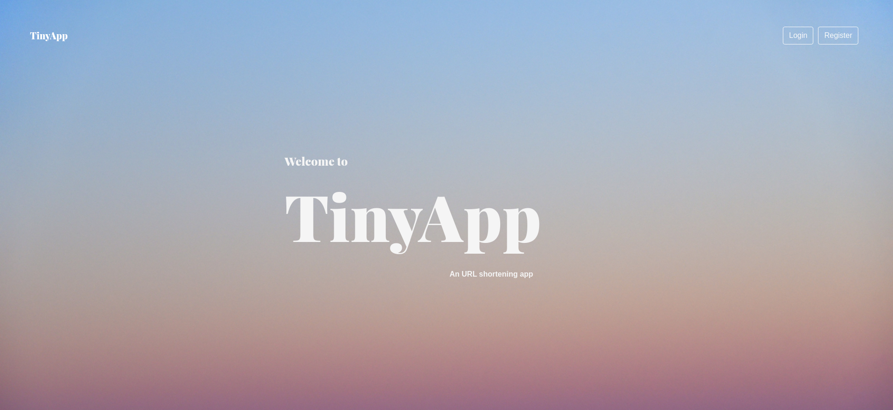
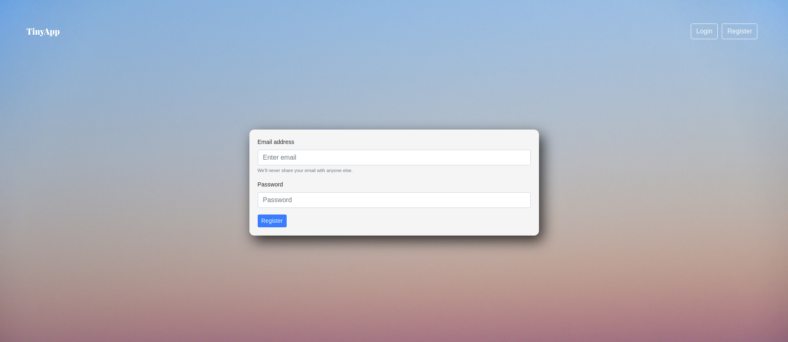
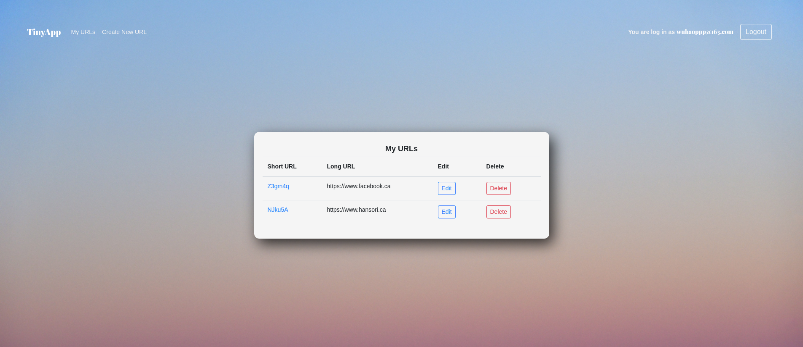

# Instroduction

This is a web application that will generate shorter URLs based on regular URls for Lighthouse Lab bootcamp Week 3.

[Click Here to see it live](https://tinyapp-ez.herokuapp.com/)

Please allow 5-10 seconds cold start. Thank you!

## Screenshots and Features

Welcome Page



User login


User Registration



Users have their own URLs



Create new shortened URL


Edit existing URL


## Dependencies

- Node.js
- Express
- EJS
- bcrypt
- body-parser
- cookie-session

## Getting Started

- Install all dependencies

```javascript
npm install
```

- Run the development web server using the

```javascript
node express_server.js
```

- visit the following link

```
localhost:8080
```
